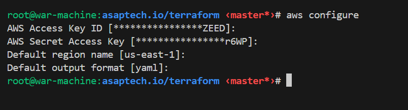
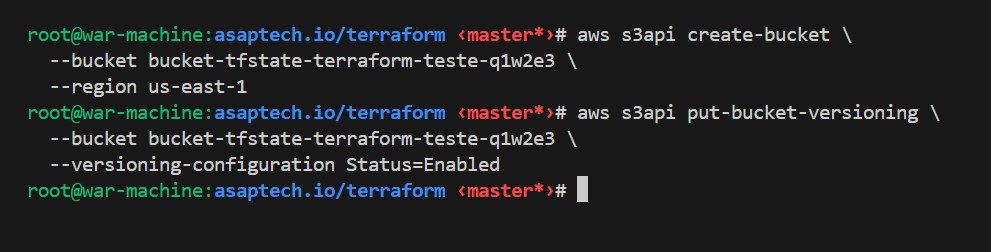
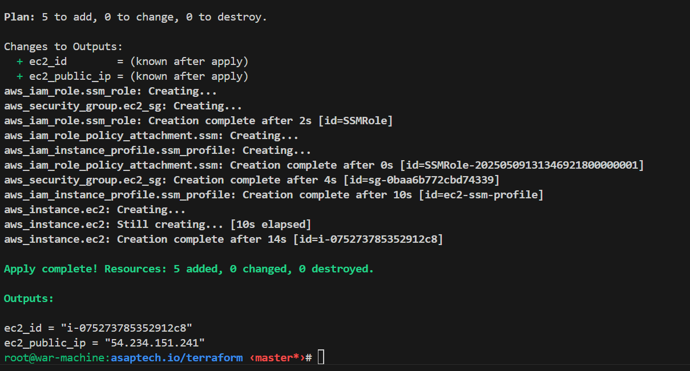
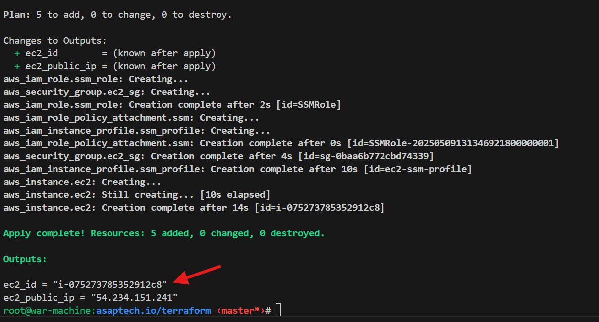
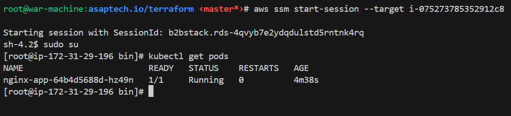
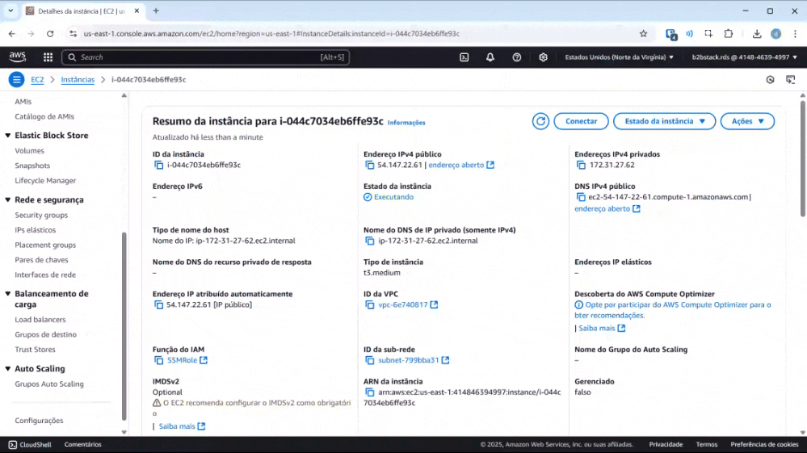
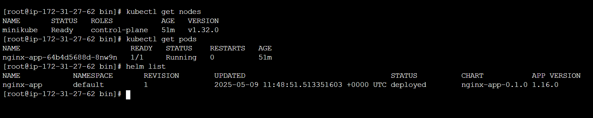

# Projeto Kubernetes com Helm e Terraform
repositório contém a configuração para provisionar uma máquina EC2 na AWS com o Terraform e instalar um **Helm Chart** para um aplicativo Kubernetes. Abaixo estão os passos necessários para configurar e executar o ambiente.

## Estrutura do projeto

```graphql
├── helm-chart/           # Contém o Helm Chart da aplicação (Deployment, Service, etc.)
│   ├── Chart.yaml        # Metadados do chart (nome, versão, etc.)
│   ├── values.yaml       # Valores padrão para o chart (imagem, porta, etc.)
│   └── templates/        # Templates YAML utilizados pelo Helm para renderizar os manifests
│       └── deployment.yaml
│
├── img/                  # Imagens e recursos visuais usados no README ou na documentação
│   └── *.png
│
├── terraform/            # Código Terraform para provisionamento da infraestrutura na AWS
│   ├── main.tf           # Arquivo Principal, com provider e data
│   ├── ec2.tf            # Recurso EC2 com instalação padrao e template para userdata automatizada via user_data
│   ├── sg.tf             # Regras de segurança para acesso à instância
│   ├── vars.tf           # variáveis usadas no projeto
│   ├── output.tf         # Saídas do terraform como IP e ID
│   ├── remote_state.tf   # Configuração do estado remoto (opcional)
│   └── user_data.sh      # Script que instala Minikube, Helm, kubectl e aplica o Helm Chart
│
├── .gitignore            # Arquivos e pastas ignorados pelo Git
├── README.md             # Documentação do projeto com instruções de uso
```

## Requisitos

- [AWS CLI](https://aws.amazon.com/cli/)
- [Terraform](https://developer.hashicorp.com/terraform/downloads)
- [SSM Plugin](https://docs.aws.amazon.com/pt_br/systems-manager/latest/userguide/session-manager-working-with-install-plugin.html)

## Observação

- O `user_data.sh` já instala e inicia tudo automaticamente.
- O acesso via SSM elimina a necessidade de chaves SSH.
- O acesso pode ser realizado pelo ssm local ou web

## 1. Configure sua AWS CLI para a região específica
Configure a AWS CLI com as suas credenciais da conta (Access Key e Secret Key):

```bash
aws configure
```


## 2. Criar um Bucket S3 para o Terraform State

Precisamos criar o bucket para armazenar o  ``tfstate`` do terraform em um bucket garantindo o estado da infraestrutura, e evitar de manter localmente, o comando define um nome padrão, caso queira alterar precisa mudar no arquivo `remote_state.tf`

```bash
aws s3api create-bucket \
  --bucket bucket-tfstate-terraform-teste-q1w2e3 \
  --region us-east-1
```
Habilitar o versionamento no bucket
```bash
aws s3api put-bucket-versioning \
  --bucket bucket-tfstate-terraform-teste-q1w2e3 \
  --versioning-configuration Status=Enabled
```


## 3. Executar terraform
Apos criar o bucket, vamos executar o terraform para aprovisionar todos os recursos.

```bash
cd terraform
terraform init
terraform plan
terraform apply -auto-approve
```
 - `cd terraform` vai entrar no diretório que contém os arquivos do terraform (onde os comandos a baixos tem que ser executados)
 - `terraform init` vai baixar e instalar os plugins do provider necessários para executar o terraform
 - `terraform plan` vai "planejar" que basicamente vai executar e mostrar na tela o que vai ser criado/alterado ou destruído
 - `terraform apply -auto-approve` vai aplicar de fato a configuração e aprovisionar o código criado o parâmetro `-auto-approve` e apenas para não confirmar após o apply 
>`-auto-approve` estou usando pois é um ambiente de teste, apenas em casos específicos

Se tudo estiver certo ao executar `terraform apply -auto-approve` vamos ter essa saída.



O Terraform vai:
 - Criar um Security Group
 - Criar uma role SSM
 - Provisionar uma EC2
 - Instalar Docker, Minikube, Helm, kubectl
 - Clonar o repositório e aplicar o helm install

## 4. Acesso à Instância
### Instalação do plugin SSM
Para evitar criação e `chave.pem` para fornecer o acesso a Instância, e configurações de sg `0.0.0.0/0` optei por fornecer o acesso via SSM. 
Ele pode ser acessado via web ou via plugins da aws pelo terminal local para instalar o plugin do ssm no linux use esse comando.

```bash
curl "https://s3.amazonaws.com/session-manager-downloads/plugin/latest/ubuntu_64bit/session-manager-plugin.deb" -o "session-manager-plugin.deb"
sudo dpkg -i session-manager-plugin.deb

aws ssm start-session
```

> para outros Sistemas Operacionais consultar a [documentação da AWS](https://docs.aws.amazon.com/pt_br/systems-manager/latest/userguide/session-manager-working-with-install-plugin.html).
### Conectando local através do plugin
com o plugin instalado vamos conectar na instância.

> Você pode pegar o `instance_id` na saída de output do terraform



```bash
aws ssm start-session --target <INSTANCE_ID>
```
Se tudo estiver certo, vamos estar conectado na instância



### Acesso pelo painel da AWS
Caso não tenha o plugin instalado na máquina, você pode acessar via web pelo painel da AWS, ao acessar a Instância criada, conecte no painel da AWS, navegue até EC2, identifique a EC2 que foi criada com o terraform e conecte como mostrado a baixo:


## 5. Validar:
Após logar via ssm, basta executar os comando, e validar o cluster (minikube) e o pod da aplicação (nginx) executando:

```bash
kubectl get nodes
kubectl get pods

helm list
```
Se tudo estiver certo, você verá o Pod instalado via Helm:



## Sobre o Helm Chart

O diretório `helm-chart` contém o chart corrigido para implantação do aplicativo.
 - O `user_data.sh` clona automaticamente este repositório e executa o comando:
  
```bash
helm install nginx-app ./helm-chart
```
deixando o deploy automático, no aprovisionamento da Instância, mas também podendo fazer atualizações manuais caso necessário
